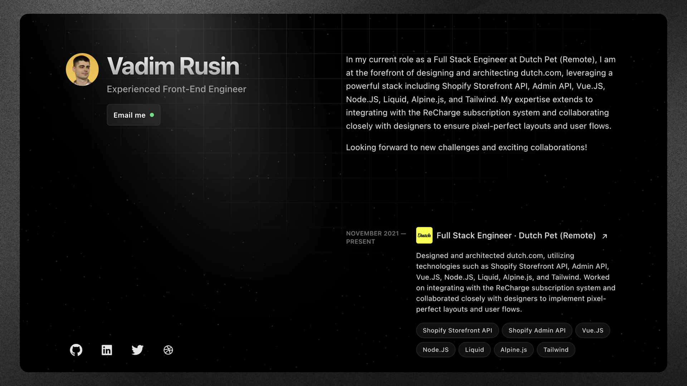

<h2 align="center">
  <p>David Kabre - Personal Website</p>
  <a href="https://tupaginapersonal.com/" target="_blank">https://tupaginapersonal.com/</a>
</h2>

<div align="center">
  
  
</div>

<p align="center">
Code is licensed under MIT, words and images are licensed under <a href='https://creativecommons.org/licenses/by-nc-sa/4.0/'>CC BY-NC-SA 4.0</a>.
</p>

## 🚀 Project Structure

Inside of the Astro project for my personal marketing and communication website, you'll find the following folders and files:

```text
/
├── public/
│   └── favicon.svg
├── src/
│   ├── components/
│   │   └── Card.astro
│   ├── layouts/
│   │   └── Layout.astro
│   └── pages/
│       └── index.astro
└── package.json
